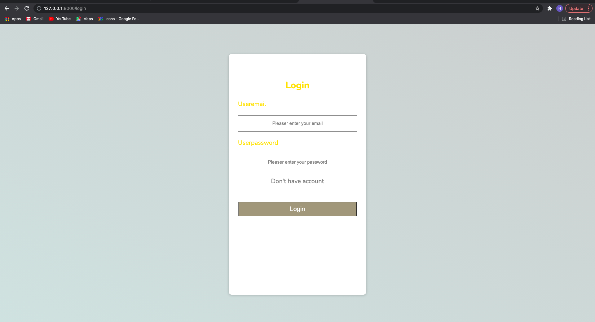
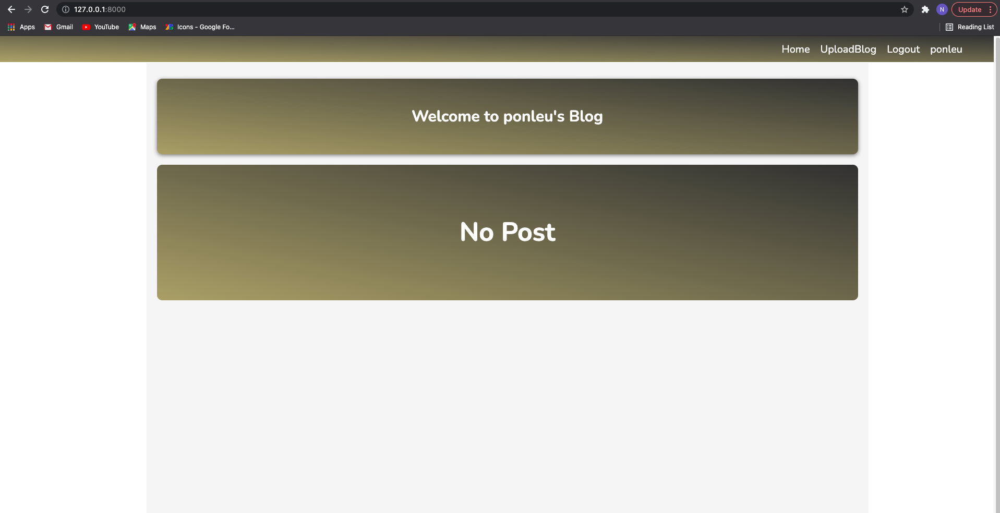

# Laravel Training 
## Use Laravel 8, CK-Editor 5

<!-- The following are Output of This project -->
### Register page

### Login page

### Home page without login

### Home page when you already login

### Manually page when you haven't login yet, or you have login but the post isn't yours
####  ( Cannot edit or delete post )

### Mannually page when you have login and the post is yours
#### ( Can edit or delete post)

### User's Deshboard page

### When there aren't any posts on user's dashboard

### Upload

